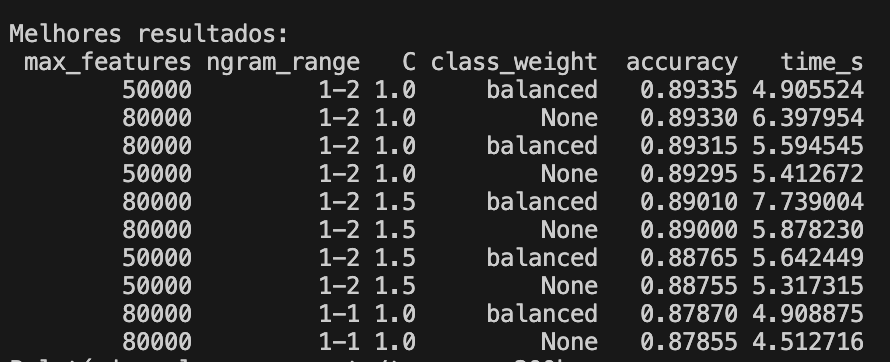

# TextSentimentAnalysis-AI

Pipeline modular de análise de sentimento (estilo Cookiecutter-DS), buscando > 85% de acurácia com TF-IDF + modelos clássicos (Linear SVM / Regressão Logística / Naive Bayes).

---

## Dados esperados

> **Importante:** os arquivos de dados **não são versionados** no repositório por causa do tamanho.  
> Você precisa baixá-los manualmente (Kaggle ou fonte equivalente) e colocá-los nas pastas corretas.

### 1. IMDb Movie Reviews (sentiment)

- Exemplo de fonte: Kaggle – dataset de reviews de filmes IMDb rotulados como positivo/negativo.  
- Baixe o CSV principal (por exemplo, `IMDB Dataset.csv`) e salve como:

```text
data/external/imdb_reviews.csv
```

### 2. Sentiment140 (tweets)

- Exemplo de fonte: Kaggle – dataset Sentiment140 com ~1.6M tweets.  
- Baixe o arquivo `training.1600000.processed.noemoticon.csv` e salve como:

```text
data/external/sentiment140.csv
```

### 3. Amazon Review Polarity

Você pode chegar nos CSVs de duas formas:

#### Opção A – CSVs já prontos (ex.: Kaggle)

- Baixe `train.csv` e `test.csv` de algum dataset binário de reviews da Amazon (positivo/negativo) e salve como:

```text
data/external/amazon_train.csv
data/external/amazon_test.csv
```

#### Opção B – Arquivos `.bz2` (formato fastText) + script `BZ2_to_CSV.py`

Se você tiver os arquivos `train.ft.txt.bz2` e `test.ft.txt.bz2`, coloque-os em:

```text
BZ2_to_CSV.py
bz2/train.ft.txt.bz2
bz2/test.ft.txt.bz2
data/external/
```

Depois rode:

```bash
poetry run python BZ2_to_CSV.py
```

O script:

- descompacta `train.ft.txt.bz2` e `test.ft.txt.bz2`
- converte para CSV com colunas `sentiment` e `text`
- salva em:

```text
data/external/amazon_train.csv
data/external/amazon_test.csv
```

---

## Script de combinação dos datasets

O script `src/data/make_dataset.py`:

- espera encontrar em `data/external/`:
  - `imdb_reviews.csv`
  - `sentiment140.csv`
  - e **algum** dos seguintes para Amazon:
    - `amazon_reviews.csv`
    - `amazon.csv`
    - `amazon_train.csv` (+ `amazon_test.csv`, se existir)
- adiciona a coluna `source` (`IMDb`, `Sentiment140`, `Amazon`)
- concatena tudo e salva em:

```text
data/interim/combined_data.csv
```

Se nenhum arquivo da Amazon for encontrado, ele lança:

> `FileNotFoundError: Nenhum arquivo Amazon encontrado em data/external (procure por amazon_reviews.csv, amazon.csv ou amazon_train.csv + amazon_test.csv)`

---

## Pipeline (como rodar)

### 1) Instalar dependências

```bash
poetry install
```

### 2) Converter Amazon de BZ2 para CSV (se necessário)

Se você estiver usando os arquivos `.bz2`:

```bash
poetry run python BZ2_to_CSV.py
```

Isso gera `amazon_train.csv` e `amazon_test.csv` em `data/external/`.

### 3) Ingestão e combinação (IMDb + Sentiment140 + Amazon)

```bash
poetry run python -m src.data.make_dataset --amazon-max 200000
```

- `--amazon-max` é opcional, útil para limitar o número de linhas da Amazon e evitar que o CSV fique gigante.
- Saída: `data/interim/combined_data.csv`.

### 4) Pré-processar (limpeza de texto + normalização de rótulos)

```bash
poetry run python -m src.data.preprocess
```

- Saída típica: `data/processed/sentiment_data.csv`.

### 5) Treinar modelo (pipeline padrão)

Exemplo com Linear SVM:

```bash
poetry run python -m src.models.train_model   --model linear_svc   --max-features 80000   --c-linear 1.5
```

- Modelos são salvos em `models/`
- Relatórios em `reports/`

---

## Comando recomendado (melhor acurácia encontrada)

- Melhor configuração encontrada nos experimentos (exemplo):  
  - `max_features=50000`  
  - `ngram_range=(1,2)`  
  - `C=1.0`  
  - `class_weight='balanced'`  
- Acurácia ≈ **89.33%** em amostra de validação.

### Experimento de tuning (amostra de 200k)

```bash
poetry run python scripts/tune_svc.py   --sample-size 200000   --out reports/tune_svc_200k.csv
```

> `scripts/tune_svc.py` realiza vetorização TF-IDF e treina LinearSVC em várias combinações rápidas; o CSV de saída contém o ranking das configurações testadas.

### Treino final — duas opções

```bash
# opção 1: rodar o tuning no conjunto completo (sample-size=0)
# e depois treinar com os melhores parâmetros encontrados
poetry run python scripts/tune_svc.py   --sample-size 0   --out reports/tune_svc_full.csv

# opção 2: treinar diretamente (ex.: usando os hiperparâmetros já conhecidos)
poetry run python -m src.models.train_model   --model linear_svc   --max-features 50000   --c-linear 1.0
```

> Nota: dependendo da versão atual de `src/models/train_model.py`, o segundo comando pode aceitar flags ligeiramente diferentes — se algum argumento não existir, use `scripts/tune_svc.py` para localizar os melhores hiperparâmetros e adaptar o script de treino conforme necessário.

#### Resultados

> Exemplo de resultado de tuning:  


---

## Estrutura de projeto

Estrutura de projeto para análise de sentimentos com organização modular e notebooks para EDA/experimentação:

```text
TextSentimentAnalysis-AI/
├── notebooks/
│   ├── 01_EDA.ipynb
│   ├── 02_Experimentation.ipynb
│   └── 03_Results.ipynb
│
├── src/
│   ├── __init__.py
│   ├── data/
│   │   ├── __init__.py
│   │   ├── make_dataset.py
│   │   └── preprocess.py
│   │
│   ├── features/
│   │   ├── __init__.py
│   │   └── build_features.py
│   │
│   ├── models/
│   │   ├── __init__.py
│   │   ├── train_model.py
│   │   └── predict_model.py
│   │
│   ├── visualization/
│   │   └── visualize.py
│
├── data/
│   ├── raw/
│   ├── interim/
│   ├── processed/
│   └── external/
│
├── models/
│   ├── model.pkl
│
├── reports/
│   └── project_report.pdf
│
├── pyproject.toml
├── README.md
└── setup.py
```

---

## Exemplo de treino rápido (Naive Bayes)

```python
import pandas as pd
from sklearn.model_selection import train_test_split
from sklearn.feature_extraction.text import TfidfVectorizer
from sklearn.naive_bayes import MultinomialNB
from sklearn.metrics import accuracy_score
import joblib

def load_and_preprocess_data():
    data = pd.read_csv('data/processed/sentiment_data.csv')
    X = data['text']
    y = data['sentiment']
    return X, y

def train_naive_bayes_model(X, y):
    vectorizer = TfidfVectorizer(stop_words='english')
    X_vectorized = vectorizer.fit_transform(X)
    X_train, X_test, y_train, y_test = train_test_split(
        X_vectorized, y, test_size=0.2, random_state=42
    )

    model = MultinomialNB()
    model.fit(X_train, y_train)
    y_pred = model.predict(X_test)
    accuracy = accuracy_score(y_test, y_pred)
    print(f'Acurácia: {accuracy * 100:.2f}%')

    joblib.dump(model, 'models/naive_bayes_model.pkl')
    joblib.dump(vectorizer, 'models/tfidf_vectorizer.pkl')

if __name__ == "__main__":
    X, y = load_and_preprocess_data()
    train_naive_bayes_model(X, y)
```

---

## Dependências

- Python >= 3.11  
- Poetry para gerenciamento de ambiente/dependências

Este README documenta o pipeline completo (ingestão, pré-processamento, treino e tuning), o uso do script de conversão BZ2 → CSV para Amazon e a estrutura modular do projeto.
